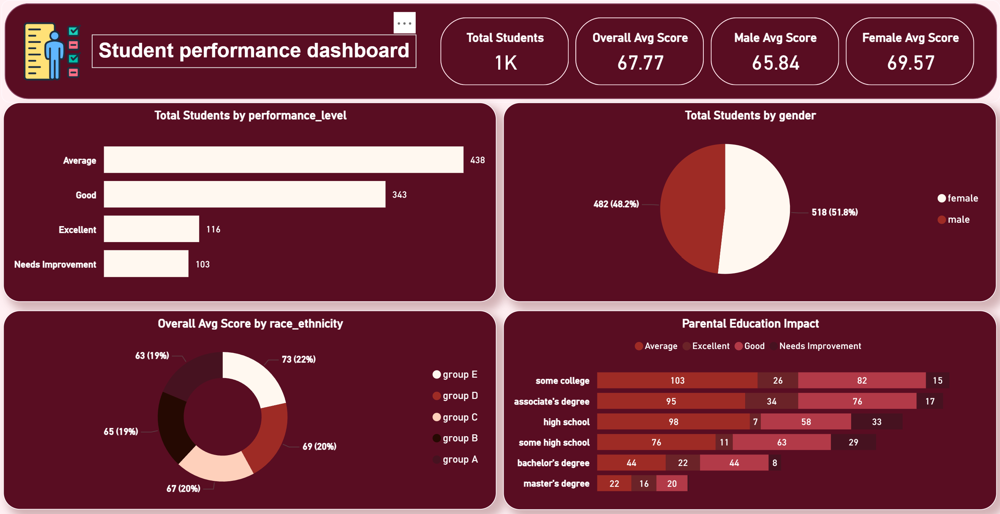

# 🎓 Student Performance Dashboard

## 📊 Project Overview

An interactive Student Performance Dashboard developed using Power BI to analyze students' academic performance, demographic characteristics, gender distribution, race/ethnicity, and the impact of parental education.

The dashboard provides a clear and interactive overview of student performance, helping identify patterns, compare student groups, and generate meaningful insights from the data.

## 🖼️ Dashboard Preview



---

## 🎯 Project Objectives

The main objectives of this dashboard are to:

- Analyze overall student performance.
- Identify the distribution of students across different performance levels.
- Compare average scores between male and female students.
- Analyze student distribution by gender.
- Explore average performance across different race/ethnicity groups.
- Investigate the relationship between parental education and student performance.
- Present key academic indicators through an interactive Power BI dashboard.

---

## 📌 Dashboard KPIs

The dashboard includes four main Key Performance Indicators:

- **Total Students:** 1K
- **Overall Average Score:** 67.77
- **Male Average Score:** 65.84
- **Female Average Score:** 69.57

---

## 📈 Dashboard Visualizations

### 1. Student Performance Levels

A horizontal bar chart showing the number of students across four performance levels:

- Average
- Good
- Excellent
- Needs Improvement

The **Average** performance category represents the largest group of students.

---

### 2. Student Distribution by Gender

A pie chart showing the distribution of students by gender:

- **Female:** 518 students (51.8%)
- **Male:** 482 students (48.2%)

The gender distribution is relatively balanced, with female students representing a slightly higher percentage.

---

### 3. Average Score by Race/Ethnicity

A donut chart analyzing the average student score across different race/ethnicity groups.

This visualization helps compare academic performance patterns among different student groups.

---

### 4. Parental Education Impact

A stacked bar chart analyzing student performance levels across different parental education backgrounds.

The analysis includes:

- Some college
- Associate's degree
- High school
- Some high school
- Bachelor's degree
- Master's degree

This visualization provides insights into how parental education levels may relate to student performance.

---

## 🧮 DAX Measures

The dashboard uses DAX measures to calculate key performance indicators and support the analysis of students' academic performance.

```DAX
Total Students =
COUNTROWS(Student_Performance)

Avg Math Score =
AVERAGE(Student_Performance[math_score])

Avg Reading Score =
AVERAGE(Student_Performance[reading_score])

Avg Writing Score =
AVERAGE(Student_Performance[writing_score])

Overall Avg Score =
AVERAGE(Student_Performance[average_score])

Female Avg Score =
CALCULATE(
    [Overall Avg Score],
    Student_Performance[gender] = "female"
)

Male Avg Score =
CALCULATE(
    [Overall Avg Score],
    Student_Performance[gender] = "male"
)

Students by Group =
COUNTROWS(Student_Performance)

These DAX calculations were used to create dynamic KPIs and support the analysis of student performance across different dimensions.
```

## 💡 Key Insights

- The majority of students fall within the **Average** performance level.
- Female students have a higher average score than male students.
- The gender distribution is relatively balanced.
- Average scores vary across different race/ethnicity groups.
- Students with different parental education backgrounds show different performance distributions.
- The dashboard provides an efficient way to compare academic performance across multiple student dimensions.

## 🛠️ Tools & Technologies

- **Power BI**
- **DAX**
- **Data Analysis**
- **Data Visualization**
- **Data Modeling**

## 👩‍💻 Author

**Yasmen Mohamed Ghonaim**  
*Data Analyst*

🌐 **Portfolio:** [View My Portfolio](https://yasmen-m7md2010.github.io/yasmen-portfolio/)

🔗 **LinkedIn:** [View LinkedIn](https://www.linkedin.com/in/yasmen-mhmd)

🔗 **GitHub:** [View GitHub](https://github.com/yasmen-m7md2010)

📧 **Email:** yasmen.m7md36@gmail.com
